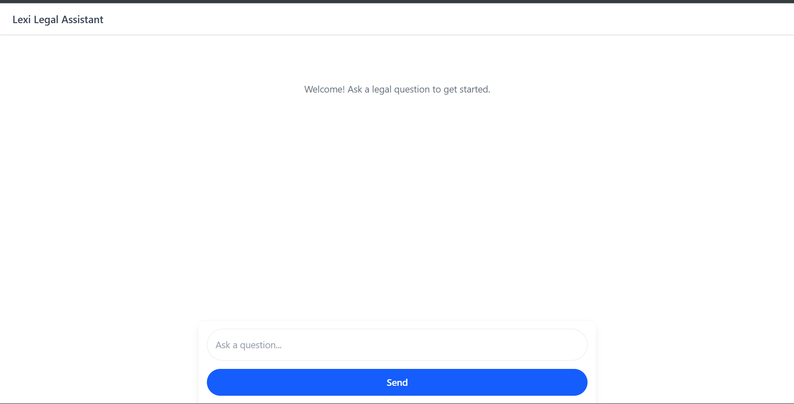
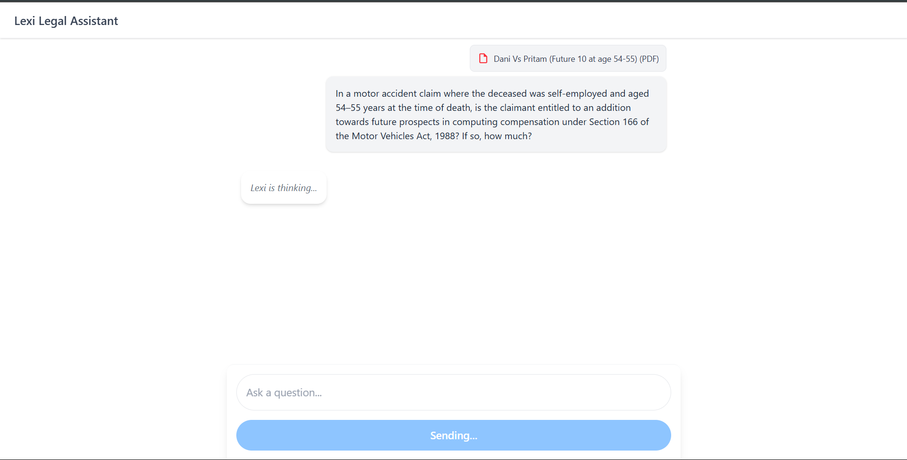
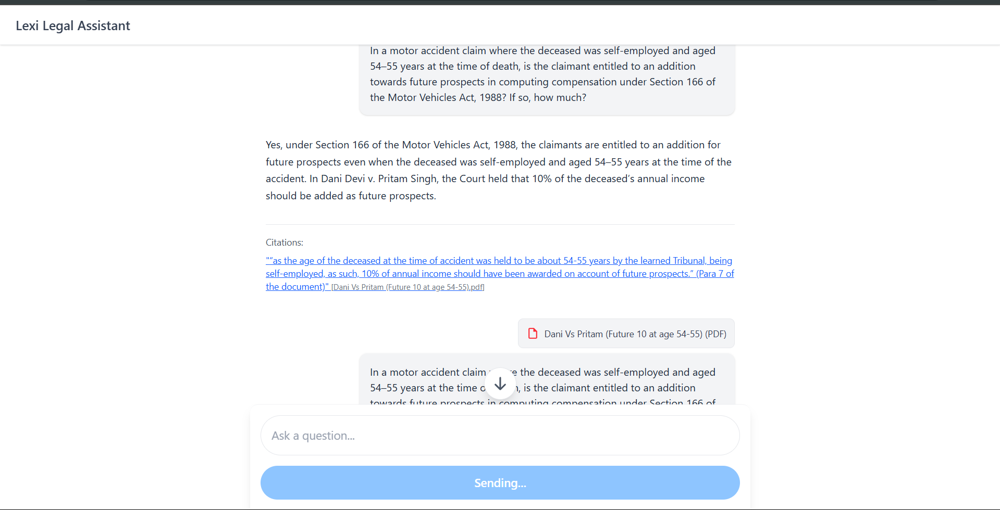
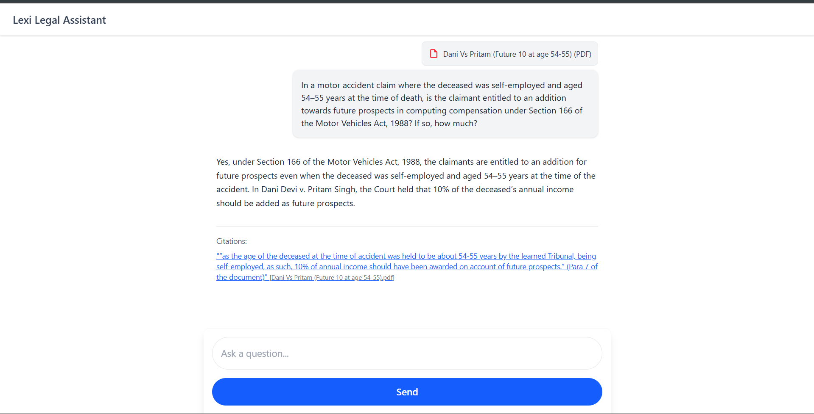
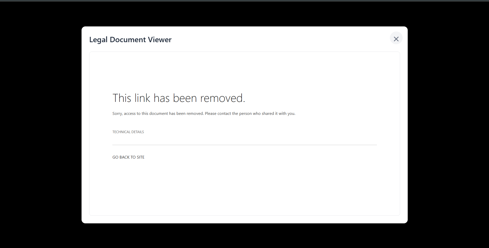

# Lexi Frontend Assignment – Legal Assistant Interface with Citations

This project implements the frontend interface for a legal assistant, designed to simulate a chat-like interaction where users can submit legal queries and receive structured answers with relevant citations. The UI aims to replicate the clean and modern aesthetic of AI chat interfaces.

## Assignment Objectives Fulfilled:

* **Input Panel:** Features a text area for legal queries and a submit button with a loading state. The text area auto-resizes and the submit button is styled to match the modern UI.
* **Answer Panel:** Displays the simulated answer text clearly, without a separate "bubble" for Lexi's response, aligning with the reference UI.
* **Citation Handling:** Citations are shown below the answer with a source label and are clickable. Clicking a citation opens the linked PDF document in a modal overlay for integrated viewing.
* **Simulated API:** The application simulates a POST request to a backend, using a predefined hardcoded response as per the assignment's instructions.
* **UI Design:** The interface is designed as a single, vertically scrolling chat view with a fixed header and a fixed input panel at the bottom. The overall styling uses Tailwind CSS v4.0 to achieve a clean, modern, visual theme with subtle colors, rounded elements, and generous spacing.
* **Scroll-to-Bottom Button:** A subtle, circular button with a downward-pointing arrow appears above the input box when the user scrolls up, allowing quick navigation to the latest messages.
* **Technology:** Built using React.js with Vite, styled with Tailwind CSS v4.0.

## How to Run the Project Locally:

1.  **Clone the repository:**
    ```bash
    git clone [https://github.com/Vicky-so6p/lexisg-frontend-intern-test.git](https://github.com/Vicky-so6p/lexisg-frontend-intern-test.git)
    cd lexisg-frontend-intern-test
    ```
2.  **Install dependencies:**
    ```bash
    npm install
    ```
3.  **Start the development server:**
    ```bash
    npm run dev
    ```
4.  Open your browser to the URL displayed in the terminal (e.g., `http://localhost:xxxx`).

## Simulated API Response Details:

The application uses a hardcoded JSON object to simulate the backend API response, as specified in the assignment.

* **Query Used for Simulation:**
    `"In a motor accident claim where the deceased was self-employed and aged 54–55 years at the time of death, is the claimant entitled to an addition towards future prospects in computing compensation under Section 166 of the Motor Vehicles Act, 1988? If so, how much?"`
* **Answer Displayed:**
    `"Yes, under Section 166 of the Motor Vehicles Act, 1988, the claimants are entitled to an addition for future prospects even when the deceased was self-employed and aged 54–55 years at the time of the accident. In Dani Devi v. Pritam Singh, the Court held that 10% of the deceased’s annual income should be added as future prospects."`
* **Citation Text Displayed:**
    `“as the age of the deceased at the time of accident was held to be about 54-55 years by the learned Tribunal, being self-employed, as such, 10% of annual income should have been awarded on account of future prospects.” (Para 7 of the document)`
* **PDF Link:** The citation links to the provided SharePoint PDF: `https://lexisingapore-my.sharepoint.com/:b:/g/personal/harshit_lexi_sg/EdDegeiR_gdBVqXdyW4xEoBCdGj5E4Bo5wjvhPHpqqIuQ?e=TeU4vz`

## Bonus Points Addressed:

* **PDF Scroll/Highlight (Mock Only):** The PDF opens in a modal, providing an integrated viewing experience. While the assignment mentions "scroll to and highlight Paragraph 7," implementing this granular functionality within an `<iframe>` is highly complex, browser-dependent, and typically requires specialized PDF rendering libraries or server-side processing beyond the scope of a pure frontend simulation. This feature is conceptually acknowledged by opening the relevant document.

## Project Structure:

    ```
    lexisg-frontend-intern-test/
    ├── public/
    ├── src/
    │   ├── components/
    │   │   ├── AnswerPanel.jsx
    │   │   ├── Citation.jsx
    │   │   ├── InputPanel.jsx
    │   │   └── PDFViewerModal.jsx
    │   ├── App.jsx
    │   └── main.jsx
    │   └── index.css
    ├── .gitignore
    ├── index.html
    ├── package.json
    ├── vite.config.js
    └── README.md
    ```

## Screenshot:





